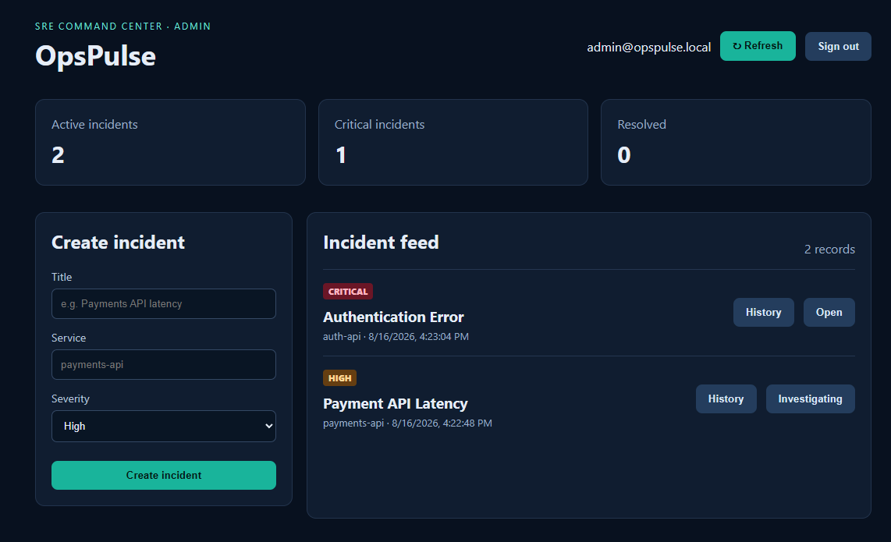

# OpsPulse

OpsPulse is an SRE operations platform for managing incidents in distributed systems. It combines a React dashboard, Python/FastAPI microservices, PostgreSQL, Redis, Prometheus, Grafana, and Kubernetes deployment assets.

## Production-minded features

- JWT authentication and role-based access control: `admin`, `responder`, and `viewer`
- Incident lifecycle management, comments, and immutable audit logs
- SLO analytics and an MTTR summary at `/api/v1/analytics/slo`
- Redis Streams event processing and optional Slack Incoming Webhook notifications
- OpenTelemetry tracing through an OTLP collector
- Prometheus metrics, alert rules, and a provisioned Grafana dashboard
- Nginx API rate limiting, Docker Compose, Kubernetes manifests, and a Helm chart
- API contract tests, GitHub Actions CI, and a k6 load-test scenario

## Architecture

```text
React dashboard -> Nginx API gateway -> Incident service -> PostgreSQL
                                          |-> Redis Streams -> Notification worker -> Slack
Prometheus <- service metrics              |-> OpenTelemetry collector
Grafana <- Prometheus
```

For the full architecture diagram, see [docs/architecture.md](docs/architecture.md). Read the implementation narrative in [docs/case-study.md](docs/case-study.md).

## Product screenshot



## Quick start

1. Copy `.env.example` to `.env` and replace all development secrets.
2. Run `docker compose up --build`.
3. Open the dashboard at http://localhost:5173.
4. Open API documentation at http://localhost:8000/docs.
5. Open Grafana at http://localhost:3000 (`admin` / `admin`).

The default development account is `admin@opspulse.local` / `ChangeMe123!`. Configure these values, `JWT_SECRET`, and (optionally) `SLACK_WEBHOOK_URL` in `.env` before using the application outside a local environment.

## Services

| Service | Responsibility |
| --- | --- |
| `incident-service` | Authentication, RBAC, incident lifecycle, audit trail, and SLO analytics |
| `notification-worker` | Consumes Redis Stream events and posts optional Slack notifications |
| `web` | React and TypeScript operations dashboard served by Nginx |
| `otel-collector` | Receives OTLP traces emitted by the API |

## Operations

Render the Helm chart:

```bash
helm template opspulse ./infra/helm/opspulse
```

Run the load test while the Compose stack is running:

```bash
k6 run tests/load/incident-flow.js
```
