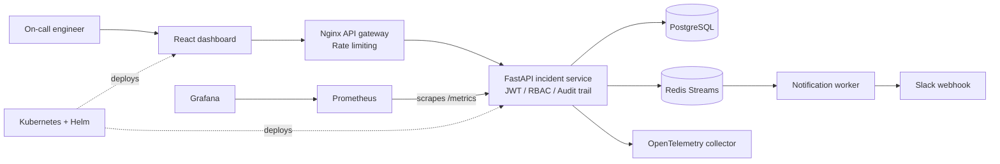

# Architecture

## Request flow

1. The dashboard authenticates with the API and stores a short-lived JWT locally.
2. Nginx applies API rate limits, attaches request metadata, and proxies requests to the incident service.
3. The service enforces role-based access, persists incident changes to PostgreSQL, and writes audit events.
4. Incident events are published to Redis Streams and handled asynchronously by the notification worker.
5. Prometheus scrapes API metrics; Grafana visualizes service health and request performance.

## Deployment model

Docker Compose provides a reproducible local environment. Kubernetes manifests and the Helm chart describe the production deployment topology, including horizontal scaling for the incident service.
